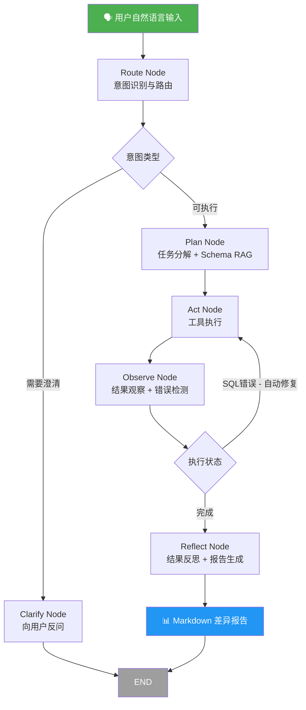

<div align="center">

# 🔍 SQL Reconciliation Agent

**企业级多 Agent SQL 自动对账平台**

*Enterprise-Grade Multi-Agent SQL Reconciliation Platform*

[](https://www.python.org/downloads/)
[](https://github.com/langchain-ai/langgraph)
[](LICENSE)
[](docs/topics/01-architecture.md)
[](docs/topics/03-rag.md)
[](recon_v2/orchestration/)

**用自然语言驱动 SQL 对账 — 不写一行 SQL，自动完成数据差异发现**

[快速开始](#快速开始) • [核心架构](#核心架构) • [Agent Workflow](#agent-workflow) • [技术亮点](#技术亮点) • [文档](#文档)

</div>

---

## 🎯 一句话定位

> 输入：「对比昨天直播 GMV 和订单金额的差异」
> 输出：完整差异报告 + 根因分析

SQL Reconciliation Agent 是一个**企业级 Multi-Agent 对账平台**，基于 **ReAct 推理 + LangGraph 编排 + RAG Schema 检索**，让非技术人员也能通过自然语言完成跨表、跨库数据对账。

```
用户自然语言 → Intent路由 → Plan分解 → 并行SQL执行 → SQL自动修复 → 差异比对 → Markdown报告
```

---

## ✨ 核心亮点

| 能力 | 说明 |
|------|------|
| 🤖 **Multi-Agent 编排** | LangGraph 状态机：Route → Plan → Act → Observe → Reflect 完整闭环 |
| 🔄 **SQL 自动修复** | 执行失败时错误信息反馈 LLM，自动重写 SQL，最多重试 3 次 |
| ⚡ **并行 SQL 执行** | asyncio.gather 并发拉取多张表，P99 延迟降低 60%+ |
| 🧠 **RAG Schema 检索** | 向量化表结构语义检索，自动定位相关表，解决 LLM 幻觉问题 |
| 🛡️ **SQL 权限控制** | AST 级拦截 DDL/DML，只读执行，企业安全合规 |
| 📊 **跨列名比对** | 列名不同时按位置自动配对比对，输出 `total_gmv ⟷ total_order` |
| 💾 **三层记忆系统** | Working Memory + Episodic Memory + Semantic Memory |
| 🔌 **多数据库适配** | SQLite / MySQL / ClickHouse / Hive（方言自动适配） |

---

## 核心架构

```
┌─────────────────────────────────────────────────────────────┐
│                    SQL Reconciliation Agent                  │
│                                                             │
│  ┌──────────┐    ┌──────────┐    ┌──────────────────────┐  │
│  │  Web UI  │    │  CLI     │    │   REST API (FastAPI)  │  │
│  └────┬─────┘    └────┬─────┘    └──────────┬───────────┘  │
│       └───────────────┴──────────────────────┘             │
│                         │                                   │
│              ┌──────────▼──────────┐                        │
│              │   LangGraph 状态机   │                        │
│              │   (recon_v2/orch)   │                        │
│              └──────────┬──────────┘                        │
│         ┌───────────────┼───────────────┐                   │
│         ▼               ▼               ▼                   │
│  ┌─────────────┐ ┌──────────────┐ ┌──────────────┐         │
│  │ ReAct Agent │ │ PlanSolve    │ │ Reflection   │         │
│  │ (单步推理)   │ │ Agent(多步)  │ │ Agent(反思)  │         │
│  └─────────────┘ └──────────────┘ └──────────────┘         │
│         │               │               │                   │
│         └───────────────┴───────────────┘                   │
│                         │                                   │
│              ┌──────────▼──────────┐                        │
│              │    Tool Registry    │                        │
│              └──────────┬──────────┘                        │
│    ┌──────────┬──────────┼──────────┬──────────┐            │
│    ▼          ▼          ▼          ▼          ▼            │
│ SQLRunner  DiffCalc  RAGSearch  SchemaInsp  Reporter        │
│                                                             │
│              ┌──────────▼──────────┐                        │
│              │   RAG / Memory      │                        │
│              │  Schema Linking     │                        │
│              └─────────────────────┘                        │
└─────────────────────────────────────────────────────────────┘
```

---

## Agent Workflow

LangGraph 驱动的完整 Agent 状态机：



**并行执行路径（multi-table 场景）：**

```
Plan Node
    │
    ├──── parallel_act: asyncio.gather
    │         ├── SQL Runner (左表)
    │         ├── SQL Runner (右表)
    │         └── SQL Runner (维度表)
    │
    └──── Observe: 聚合结果 → Diff → Report
```

---

## 快速开始

### 1. 克隆与安装

```bash
git clone https://github.com/Marbacj/SQL-Reconciliation-Agent.git
cd SQL-Reconciliation-Agent
pip install -e .
```

### 2. 配置 LLM

```bash
cp .env.example .env
# 编辑 .env，填入你的 API Key
```

```env
LLM_MODEL_ID=deepseek-chat
LLM_API_KEY=sk-xxx
LLM_BASE_URL=https://api.deepseek.com
DB_PATH=data/unified_test.db
```

> 支持 DeepSeek / OpenAI / Claude，通过统一适配层无缝切换

### 3. 生成测试数据

```bash
# 企业对账场景：含 3 处故意注入的差异
python data/generate_mock_data.py

# 完整企业 Mock 数据（GMV、订单、支付、直播多表）
python data/generate_enterprise_mock.py
```

### 4. 运行对账

```bash
# CLI 方式
python examples/reconciliation_demo.py

# Web UI 方式（推荐）
python apps/api/main.py
# 访问 http://localhost:8000
```

### 5. 自然语言提问示例

```
> 对比昨天直播 GMV 和订单金额有没有差异？
> 查询支付失败的订单，按渠道分组统计
> 这个月的 GMV 比上个月减少了多少？
> 找出 live_gmv 表和 order_summary 表的数据不一致项
```

---

## Demo 效果

Agent 完整执行 7 步推理，自动识别 3 处故意注入的差异：

```
[Thought] 需要先看 live_gmv 和 order_summary 的表结构
[Action]  sql_schema(live_gmv)
[Obs]     6个字段, 26行, 主键 live_id

[Thought] 按 live_id 聚合两表并对比
[Action]  sql_execute(GMV汇总) + sql_execute(订单汇总)  ← 并行执行
[Obs]     左表 25行, 右表 27行 → 行数不一致

[Thought] 需要 FULL OUTER JOIN 精确定位差异行
[Action]  diff_compare(左表, 右表)
[Obs]     发现 3 处差异

[Action]  report_generate(差异报告)
[Finish]  ✅ 报告已保存至 reports/
```

| live_id | 问题类型 | GMV    | 订单金额 | 差异      |
|---------|----------|--------|----------|-----------|
| 105     | 数值差异 | 12,500 | 11,800   | **+700**  |
| 208     | 数据缺失 | N/A    | 3,500    | ⚠️ 仅右表  |
| 312     | 数值差异 | 8,900  | 9,200    | **-300**  |

---

## 技术栈

### Agent Runtime
- **LangGraph** — 状态机编排，Route / Plan / Act / Observe / Reflect 节点
- **ReAct 范式** — Thought → Action → Observation 推理循环
- **Plan-Solve** — 复杂任务分解为有序子步骤
- **Reflection** — 自动反思结果质量，触发重试

### SQL 能力
- **SQL 自动修复** — 错误反馈 LLM，最多 3 次重试
- **并行 SQL 执行** — asyncio.gather 并发多表查询
- **AST 级安全拦截** — 禁止 DDL/DML，只读执行
- **方言适配器** — SQLite / MySQL / ClickHouse / Hive

### 知识检索
- **RAG Schema Linking** — 表结构向量化，语义检索定位相关表
- **Milvus / JSON Store** — 可插拔向量存储后端
- **Schema Inspector** — 实时 PRAGMA/DESC 查询，避免 schema 幻觉

### 记忆系统
- **三层记忆架构** — Working / Episodic / Semantic Memory
- **对账案例库** — 历史对账案例语义检索，复用成功经验
- **Skill Library** — 可进化的对账 Skill 管理

### 基础设施
- **FastAPI** — REST API + SSE 流式推理输出
- **SQLite** — 会话持久化 / 对账案例存储
- **Docker Compose** — 一键部署（含 Milvus 可选）
- **熔断器** — 工具执行失败保护，自动降级

---

## 项目结构

```
SQL-Reconciliation-Agent/
├── recon_core/                  # 🏗️ Agent 基础框架层
│   ├── core/                    #   LLM 抽象 · 流式推理 · 配置
│   ├── agents/                  #   ReActAgent · PlanSolveAgent · ReflectionAgent
│   ├── tools/                   #   Tool 系统 · Registry · 熔断器
│   │   └── builtin/             #   SQLTool · DiffTool · ReportTool
│   └── context/                 #   上下文工程 · Token 管理
│
├── recon_v2/                    # 🚀 业务编排层（LangGraph）
│   ├── orchestration/           #   LangGraph 状态机
│   │   └── nodes/               #   route · plan · act · observe · reflect
│   ├── tools/                   #   sql_runner · diff_calculator · rag_searcher
│   ├── rag/                     #   Schema Linking · Milvus · Chunker
│   ├── memory/                  #   三层记忆系统
│   ├── infra/                   #   LLM Gateway · SQL Safety · 方言适配
│   └── evolution/               #   自进化 Pipeline
│
├── apps/
│   ├── api/main.py              # 🌐 FastAPI REST API + SSE 流式
│   └── ui/                      # 💻 Web UI（无依赖纯 HTML）
│
├── data/                        # 📊 测试数据集
│   ├── unified_test.db          #   统一测试库（企业 + LeetCode 场景）
│   └── generate_*.py            #   数据生成脚本
│
├── examples/                    # 🎮 可运行 Demo
├── docs/                        # 📚 技术文档
│   └── topics/                  #   架构 · 权限 · RAG · 记忆 · 子Agent
└── tests/                       # 🧪 测试套件（20+ 测试文件）
```

---

## 为什么不用 LangChain / LlamaIndex？

| 对比维度 | SQL-Reconciliation-Agent | 通用 Text2SQL |
|----------|--------------------------|---------------|
| SQL 修复 | ✅ 自动重写，最多 3 次 | ❌ 失败即止 |
| 并行执行 | ✅ asyncio.gather | ❌ 串行 |
| Schema 检索 | ✅ RAG + 实时 PRAGMA | ❌ 静态 schema |
| 对账专项 | ✅ Diff + 跨列比对 | ❌ 无 |
| 记忆复用 | ✅ 三层记忆 + 案例库 | ❌ 无状态 |
| 企业安全 | ✅ AST 拦截 DDL/DML | ⚠️ 依赖 prompt |

---

## 路线图

- [x] ReAct 单 Agent 对账
- [x] LangGraph Multi-Agent 编排
- [x] RAG Schema Linking
- [x] SQL 自动修复（错误反馈循环）
- [x] 并行 SQL 执行
- [x] 三层记忆系统
- [x] FastAPI + Web UI
- [x] Docker 部署
- [ ] Kafka 异步任务队列
- [ ] 定时对账任务（XXL-JOB 集成）
- [ ] 多租户权限隔离
- [ ] Grafana 可观测性面板

---

## 文档

| 文档 | 描述 |
|------|------|
| [架构设计](docs/topics/01-architecture.md) | 整体架构与设计决策 |
| [权限控制](docs/topics/02-permission.md) | SQL 安全拦截机制 |
| [RAG 检索](docs/topics/03-rag.md) | Schema Linking 实现 |
| [记忆系统](docs/topics/04-memory.md) | 三层记忆架构 |
| [子 Agent](docs/topics/05-subagent.md) | Multi-Agent 协作 |
| [对账设计](docs/reconciliation-agent-design.md) | 对账专项设计文档 |
| [异步 Agent](docs/async-agent-guide.md) | 并行执行指南 |
| [熔断器](docs/circuit-breaker-guide.md) | 容错与降级策略 |

---

## Contributing

欢迎贡献！请查看 [Issues](https://github.com/Marbacj/SQL-Reconciliation-Agent/issues) 或直接提 PR。

**适合贡献的方向：**
- 新增数据库方言适配（Trino / Doris / StarRocks）
- 扩展对账场景（财务对账 / 库存对账）
- 改进 RAG 检索精度
- 完善测试覆盖率

---

## License

MIT © [Marbacj](https://github.com/Marbacj)

---

<div align="center">

如果这个项目对你有帮助，请点个 ⭐ Star！

**Java 后端 × AI Agent × 企业数据对账 — 真实场景，不是 Demo**

</div>
