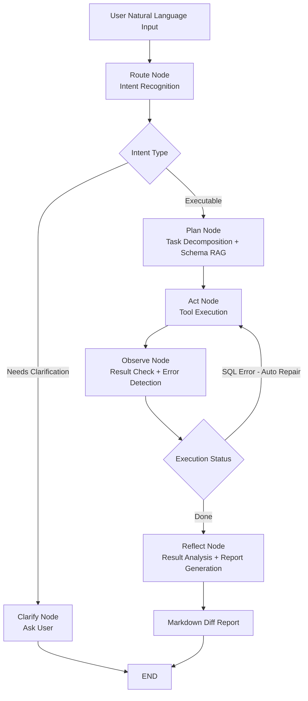

<div align="center">

# 🔍 SQL Reconciliation Agent

**Enterprise-Grade Multi-Agent SQL Reconciliation Platform**

[](https://www.python.org/downloads/)
[](https://github.com/langchain-ai/langgraph)
[](LICENSE)
[](docs/topics/01-architecture.md)
[](docs/topics/03-rag.md)
[](recon_v2/orchestration/)

**Natural language → SQL execution → Difference report. No SQL required.**

[Quick Start](#quick-start) • [Architecture](#architecture) • [Agent Workflow](#agent-workflow) • [Features](#features) • [Docs](#documentation)

</div>

---

## What is this?

> Input: "Compare yesterday's live stream GMV vs order amounts and find discrepancies"
> Output: Full difference report with root cause analysis

SQL Reconciliation Agent is an **enterprise-grade Multi-Agent reconciliation platform** built on **ReAct reasoning + LangGraph orchestration + RAG Schema Retrieval**. It enables non-technical users to perform cross-table, cross-database data reconciliation through natural language.

```
Natural Language → Intent Routing → Plan Decomposition → Parallel SQL Execution → Auto SQL Repair → Diff Analysis → Markdown Report
```

---

## ✨ Features

| Capability | Description |
|------------|-------------|
| 🤖 **Multi-Agent Orchestration** | LangGraph state machine: Route → Plan → Act → Observe → Reflect |
| 🔄 **Auto SQL Repair** | On failure, error is fed back to LLM for SQL rewrite, up to 3 retries |
| ⚡ **Parallel SQL Execution** | asyncio.gather concurrent multi-table queries, 60%+ latency reduction |
| 🧠 **RAG Schema Linking** | Vectorized schema semantic retrieval, auto-resolves LLM hallucination |
| 🛡️ **SQL Permission Control** | AST-level DDL/DML interception, read-only execution |
| 📊 **Cross-Column Diff** | Position-based column matching when names differ: `total_gmv ⟷ total_order` |
| 💾 **3-Tier Memory System** | Working Memory + Episodic Memory + Semantic Memory |
| 🔌 **Multi-DB Adapters** | SQLite / MySQL / ClickHouse / Hive with dialect auto-adaptation |

---

## Architecture

```
┌─────────────────────────────────────────────────────────────┐
│                 SQL Reconciliation Agent                     │
│                                                             │
│  ┌──────────┐    ┌──────────┐    ┌──────────────────────┐  │
│  │  Web UI  │    │   CLI    │    │  REST API (FastAPI)   │  │
│  └────┬─────┘    └────┬─────┘    └──────────┬───────────┘  │
│       └───────────────┴──────────────────────┘             │
│                         │                                   │
│              ┌──────────▼──────────┐                        │
│              │  LangGraph State    │                        │
│              │  Machine (recon_v2) │                        │
│              └──────────┬──────────┘                        │
│         ┌───────────────┼───────────────┐                   │
│         ▼               ▼               ▼                   │
│  ┌─────────────┐ ┌──────────────┐ ┌──────────────┐         │
│  │ ReAct Agent │ │ PlanSolve    │ │ Reflection   │         │
│  │ (single-step│ │ Agent        │ │ Agent        │         │
│  └─────────────┘ └──────────────┘ └──────────────┘         │
│                         │                                   │
│              ┌──────────▼──────────┐                        │
│              │    Tool Registry    │                        │
│              └──────────┬──────────┘                        │
│    ┌──────────┬──────────┼──────────┬──────────┐            │
│    ▼          ▼          ▼          ▼          ▼            │
│ SQLRunner  DiffCalc  RAGSearch  SchemaInsp  Reporter        │
│                                                             │
│              ┌──────────▼──────────┐                        │
│              │  RAG / Memory       │                        │
│              │  Schema Linking     │                        │
│              └─────────────────────┘                        │
└─────────────────────────────────────────────────────────────┘
```

---

## Agent Workflow



**Parallel Execution Path (multi-table):**

```
Plan Node
    │
    ├──── parallel_act: asyncio.gather
    │         ├── SQL Runner (left table)
    │         ├── SQL Runner (right table)
    │         └── SQL Runner (dimension table)
    │
    └──── Observe: Merge results → Diff → Report
```

---

## Quick Start

### 1. Clone & Install

```bash
git clone https://github.com/Marbacj/SQL-Reconciliation-Agent.git
cd SQL-Reconciliation-Agent
pip install -e .
```

### 2. Configure LLM

```bash
cp .env.example .env
# Edit .env with your API key
```

```env
LLM_MODEL_ID=deepseek-chat
LLM_API_KEY=sk-xxx
LLM_BASE_URL=https://api.deepseek.com
DB_PATH=data/unified_test.db
```

> Supports DeepSeek / OpenAI / Claude via unified adapter

### 3. Generate Test Data

```bash
# Enterprise reconciliation scenario (3 injected discrepancies)
python data/generate_mock_data.py

# Full enterprise mock data (GMV, orders, payments, live streams)
python data/generate_enterprise_mock.py
```

### 4. Run

```bash
# CLI mode
python examples/reconciliation_demo.py

# Web UI mode (recommended)
python apps/api/main.py
# Visit http://localhost:8000
```

### 5. Example Queries

```
> Compare yesterday's live GMV vs order amounts
> Find payment failures grouped by channel
> How much did GMV decrease this month vs last month?
> Find rows that exist in live_gmv but not in order_summary
```

---

## Demo Output

Agent executes 7 reasoning steps, identifies 3 injected discrepancies:

```
[Thought] Need to check schema of live_gmv and order_summary
[Action]  sql_schema(live_gmv)
[Obs]     6 columns, 26 rows, primary key: live_id

[Thought] Aggregate both tables by live_id and compare
[Action]  sql_execute(GMV summary) + sql_execute(order summary)  ← parallel
[Obs]     Left: 25 rows, Right: 27 rows → row count mismatch

[Thought] Need FULL OUTER JOIN to pinpoint discrepancies
[Action]  diff_compare(left_table, right_table)
[Obs]     3 discrepancies found

[Action]  report_generate(diff_report)
[Finish]  ✅ Report saved to reports/
```

| live_id | Issue Type | GMV    | Order Amount | Diff      |
|---------|------------|--------|--------------|-----------|
| 105     | Value Diff | 12,500 | 11,800       | **+700**  |
| 208     | Missing    | N/A    | 3,500        | ⚠️ Right only |
| 312     | Value Diff | 8,900  | 9,200        | **-300**  |

---

## Tech Stack

### Agent Runtime
- **LangGraph** — State machine: Route / Plan / Act / Observe / Reflect nodes
- **ReAct Pattern** — Thought → Action → Observation reasoning loop
- **Plan-Solve** — Decompose complex tasks into ordered sub-steps
- **Reflection** — Auto-evaluate result quality, trigger retry

### SQL Capabilities
- **Auto SQL Repair** — Error feedback to LLM, up to 3 retries
- **Parallel SQL Execution** — asyncio.gather concurrent multi-table queries
- **AST-level Security** — Block DDL/DML, read-only execution
- **Dialect Adapters** — SQLite / MySQL / ClickHouse / Hive

### Knowledge Retrieval
- **RAG Schema Linking** — Vectorized schema semantic retrieval
- **Milvus / JSON Store** — Pluggable vector storage backends
- **Schema Inspector** — Real-time PRAGMA/DESC, eliminates schema hallucination

### Memory System
- **3-Tier Memory** — Working / Episodic / Semantic Memory
- **Case Library** — Semantic search over historical reconciliation cases
- **Skill Library** — Evolvable reconciliation skill management

### Infrastructure
- **FastAPI** — REST API + SSE streaming inference output
- **SQLite** — Session persistence / case storage
- **Docker Compose** — One-command deployment
- **Circuit Breaker** — Tool execution protection with auto-fallback

---

## Project Structure

```
SQL-Reconciliation-Agent/
├── recon_core/                  # 🏗️ Agent Framework Layer (reusable infra)
│   ├── core/                    #   LLM abstraction · streaming · config
│   ├── agents/                  #   ReActAgent · PlanSolveAgent · ReflectionAgent
│   ├── tools/                   #   Tool system · Registry · Circuit Breaker
│   └── context/                 #   Context engineering · Token management
│
├── recon_v2/                    # 🚀 Business Orchestration Layer (LangGraph)
│   ├── orchestration/           #   LangGraph state machine
│   │   └── nodes/               #   route · plan · act · observe · reflect
│   ├── tools/                   #   sql_runner · diff_calculator · rag_searcher
│   ├── rag/                     #   Schema Linking · Milvus · Chunker
│   ├── memory/                  #   3-tier memory system
│   ├── infra/                   #   LLM Gateway · SQL Safety · dialect adapter
│   └── evolution/               #   Self-evolving pipeline
│
├── apps/
│   ├── api/main.py              # 🌐 FastAPI REST API + SSE streaming
│   └── ui/                      # 💻 Web UI (zero-dependency HTML)
│
├── data/                        # 📊 Test datasets
├── examples/                    # 🎮 Runnable demos
├── docs/                        # 📚 Technical documentation
└── tests/                       # 🧪 Test suite (20+ test files)
```

---

## Why Not Just Use LangChain?

| Dimension | SQL-Reconciliation-Agent | Generic Text2SQL |
|-----------|--------------------------|-----------------|
| SQL Repair | ✅ Auto-rewrite, 3 retries | ❌ Fail immediately |
| Parallel Exec | ✅ asyncio.gather | ❌ Serial |
| Schema Retrieval | ✅ RAG + real-time PRAGMA | ❌ Static schema |
| Reconciliation | ✅ Diff + cross-column match | ❌ Not supported |
| Memory Reuse | ✅ 3-tier memory + case library | ❌ Stateless |
| Enterprise Security | ✅ AST-level DDL/DML block | ⚠️ Prompt-based only |

---

## Roadmap

- [x] ReAct single-agent reconciliation
- [x] LangGraph multi-agent orchestration
- [x] RAG Schema Linking
- [x] SQL auto-repair (error feedback loop)
- [x] Parallel SQL execution
- [x] 3-tier memory system
- [x] FastAPI + Web UI
- [x] Docker deployment
- [ ] Kafka async task queue
- [ ] Scheduled reconciliation (XXL-JOB integration)
- [ ] Multi-tenant permission isolation
- [ ] Grafana observability dashboard

---

## Documentation

| Document | Description |
|----------|-------------|
| [Architecture](docs/architecture.md) | System architecture and design decisions |
| [Architecture (Topics)](docs/topics/01-architecture.md) | Architecture overview |
| [Permission Control](docs/topics/02-permission.md) | SQL security interception |
| [RAG Retrieval](docs/topics/03-rag.md) | Schema Linking implementation |
| [Memory System](docs/topics/04-memory.md) | 3-tier memory architecture |
| [Sub-Agent](docs/topics/05-subagent.md) | Multi-Agent collaboration |
| [Reconciliation Design](docs/reconciliation-agent-design.md) | Reconciliation-specific design |

---

## Contributing

Contributions welcome! Check [Issues](https://github.com/Marbacj/SQL-Reconciliation-Agent/issues) or submit a PR.

**Good first contributions:**
- New database dialect adapters (Trino / Doris / StarRocks)
- New reconciliation scenarios (finance / inventory)
- Improve RAG retrieval accuracy
- Expand test coverage

---

## License

MIT © [Marbacj](https://github.com/Marbacj)

---

<div align="center">

If this project helps you, please give it a ⭐ Star!

**Java Backend × AI Agent × Enterprise Data Reconciliation — Real use cases, not a demo**

</div>
