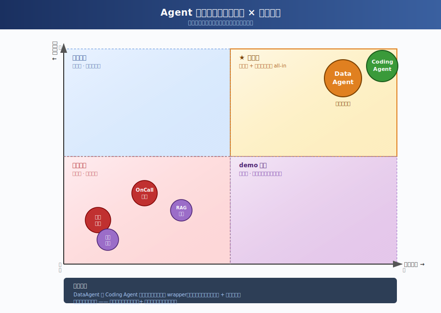
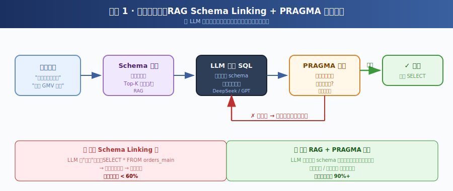

# 我为什么不做 OnCall，不做客服，只死磕Data Agent

> 项目：[SQL-Reconciliation-Agent](https://github.com/Marbacj/SQL-Reconciliation-Agent)
> 一句话：**DataAgent 不是 ChatBot，它是数据世界的自动驾驶。**

---

## 开篇：一个反直觉的判断

2026 年到现在，我看过太多 Agent 项目了。

OnCall 助手、企业知识库问答、客服机器人、邮件助手、会议纪要……几乎每周都有人发新仓库，README 里写着"基于 LangChain + RAG，效率提升 10 倍"。

但我自己灵光一闪选择做的是一个看起来"不那么 sexy"的方向 —— **SQL 对账 Agent**。

很多人问我：

> "为什么不做 OnCall？为什么不做客服？这两个不是更容易拿到 demo、更容易讲故事吗？"

我的回答只有一句：

> **因为那两条路，本质上都是问答 wrapper。而我赌的是 —— 未来真正值钱的 Agent，是能替你做决策的那种。**

这篇文章，我想把这一年我踩的坑、想清楚的事、还没想清楚的事，全部摊在桌面上讲一讲。

---

## 一、我为什么放弃 OnCall 助手和智能客服

先说结论：**这两个方向，看起来是 AI 的红利地，其实是 AI 的红海地。**

### OnCall 助手：天花板低，护城河浅

OnCall 助手的需求很真实：研发同学半夜被 P0 叫起来，想问"这个报错日志我之前是不是查过？" —— 这个场景很痛。

但做下去就会发现：

- **场景太碎**：每个公司、每个团队、每个系统，OnCall 的知识形态都不一样。Wiki、Confluence、飞书文档、群聊截图、口口相传……
- **强依赖企业内部知识库**：你做的那一套召回，离开这家公司就废了。换一家就要重做。
- **demo 容易，产品难**：搭一个 RAG + GPT 半天就能跑，但要让一线研发愿意天天用，这中间有一条巨大的鸿沟。
- **评价标准模糊**：用户说"这个回答还行吧"，到底是行还是不行？没有 ground truth。

一句话：**OnCall 助手是个"项目"，不是个"产品"。**

### 智能客服：被巨头碾压的红海

客服这个赛道更直接：

- LLM 出现之前，FAQ 检索、意图识别、对话管理 …… 早就有一整套成熟方案（小蜜、智齿、网易七鱼）。
- LLM 加进来之后，边际效用其实没那么大 —— 用户问的 80% 还是那些 FAQ。
- 大厂（阿里云、火山、腾讯云）已经把这块做成了 PaaS，价格压到很低。
- 一个人想从这里切进去？除非你有独家数据或独家场景，否则就是给巨头当陪练。

### 这两个方向的共同毛病

我后来想明白一件事：

> **OnCall 助手和智能客服，本质上都是"问答 wrapper"。它们只检索信息，不做决策。**

而 LLM 时代真正的红利，不在"信息检索"，而在"自动化决策"。

一个只会回答"你应该看这篇 Wiki"的助手，和一个能直接帮你**查出昨天哪笔订单对不上、并告诉你差在哪一行**的 Agent，价值差了不止一个数量级。

---

## 二、为什么我赌 DataAgent

如果说 OnCall 和客服是"信息检索类"Agent，那我赌的方向是 —— **决策执行类 Agent**。

而所有决策的起点，是数据。

### 一个被低估的事实

> **企业里最值钱的资产是数据，但 95% 的人不会写 SQL。**

这句话不是我编的，是我跟无数运营、产品、财务、风控的同学聊出来的：

- 运营想看"昨天华东大区某个品类的退款率"，要找数据同学排期，等 3 天。
- 财务做对账，每个月手工跑 N 张 Excel，跨表 VLOOKUP 跑到崩溃。
- 产品想验证一个假设，要么等 BI 拉数，要么自己上 Tableau 拖一下午。

现有的 BI 工具，无论是 Tableau 还是帆软，本质都是 **"让人去拖拉拽"**。

它们解决的是"可视化"问题，不是"决策"问题。

### DataAgent 是 BI 的下一代

我画了一张我自己理解的 Agent 价值象限图：



我的判断是：

- **DataAgent 和 Coding Agent**，是当下少数同时具备"高技术壁垒 + 高商业价值"的方向。
- 它们都不是"问答"，而是"生成可执行产物"——SQL、代码、报表、决策建议。
- 它们都有非常明确的"成功/失败"定义：SQL 跑不跑得通、代码过不过测试、对账对不对得上。

### 为什么 DataAgent 有付费意愿

这一点很重要，做开源也好做产品也好，**"有人愿意付钱"是一切的前提**。

我观察下来，企业愿意为这几类数据场景付钱：

| 场景            | 付费方      | 原因                      |
| ------------- | -------- | ----------------------- |
| **对账**        | 财务、风控    | 人工成本高、错一笔损失大            |
| **BI 自助查询**   | 运营、产品    | 数据团队是瓶颈，业务方愿意自己解决       |
| **数据质量监控**    | 数据平台     | 数据出问题影响下游一切             |
| **指标解释 / 归因** | 老板、业务负责人 | "为什么 GMV 跌了" 是每天都要回答的问题 |

这四类，我目前先啃下了第一类 —— **对账**。因为它边界清晰、可验证、可演进。

> **对账是 DataAgent 最好的入门赛道：场景具体，对错可验证，能做出真正的 production grade。**

---

## 三、我一个人踩的 6 个坑

讲完为什么，讲讲怎么做。这部分我尽量真诚，不端着。

### 挑战 1：LLM 的幻觉 —— 表名、列名瞎编

刚开始最离谱的 case：我让 LLM 写一条查询，它自信满满地用了一个**根本不存在的表名**。

我当时问它："你怎么知道有这张表？"
它说："根据您的描述推测的。"

🙃

**解决方式：RAG Schema Linking + 实时 PRAGMA 校验。**

- 启动时把所有表结构（表名 + 列名 + 注释）灌进向量库
- 用户问题先过一遍 schema 检索，只把相关的几张表喂给 LLM
- LLM 生成 SQL 后，再用 `PRAGMA table_info()` 实时验一遍列存不存在



### 挑战 2：SQL 生成不可靠 —— 一次成功率不到 60%

光靠 prompt 让 LLM 写对 SQL，是不现实的。

跨表连接写错 ON 条件、聚合写错 GROUP BY、字段类型不匹配 …… 一次成功率我自己测下来不到 60%。

**解决方式：错误反馈循环 + 自动修复。**

- SQL 执行失败时，把数据库返回的真实错误（"no such column: xxx"）原样回喂给 LLM
- 设置最大重试次数（默认 3 次）
- 每次重试都把上一次的错误和代码作为 context

这一招上线后，端到端成功率拉到了 **90%+**。

> **不要试图让 LLM 一次写对。让它一次写不对、然后看着错误改对 —— 这才是工程化思维。**

### 挑战 3：单 Agent 推不动复杂任务 —— 上下文爆炸

最早我是单 Agent 一把梭：把 schema、问题、规则、历史全塞进一个 prompt。

结果是：

- prompt 长度爆炸，token 烧得心疼
- LLM 注意力分散，输出质量下滑
- 错了不知道是哪一步错的，没法 debug

**解决方式：LangGraph 多 Agent 编排。**

我把流程拆成 5 个节点：

```
Route（路由意图） → Plan（拆解步骤） → Act（生成 SQL） → Observe（执行 + 校验） → Reflect（沉淀经验）
```

每个节点职责单一、prompt 简短、可独立测试。出错了一眼能看出是哪一环挂了。

### 挑战 4：性能问题 —— 多表查询串行慢

对账场景天然要查多张表（订单表、支付流水、退款表 …）。

最早我是串行查的，5 张表 = 5 次往返，慢得感人。

**解决方式：`asyncio.gather` 并行执行。**

- Plan 阶段把可并行的子任务标出来
- Act 阶段用 `asyncio.gather` 一次性发出去
- 单次对账时间从 ~12s 压到 ~3s

### 挑战 5：信任问题 —— LLM 写的 SQL，凭什么敢直接跑？

这是我做这个项目最早期就在思考的：

> **如果 LLM 写了一句 `DROP TABLE orders`，谁来兜底？**

很多 NL2SQL 项目对这块是没认真处理的。

**解决方式：AST 级权限拦截 + 只读执行。**

- 用 `sqlparse` 把生成的 SQL 解析成 AST
- 黑名单拦截：DDL（DROP/ALTER/CREATE）、DML（DELETE/UPDATE/INSERT）一律拒绝
- 数据库连接强制 `read_only=True`
- 表级 / 字段级权限可通过配置文件细化

**双层防护：第一层在生成后拦截，第二层在执行时兜底。一层失守还有另一层。**

### 挑战 6：一个人做开源的孤独感

这个最难，没办法用代码解决。

- 项目刚发出去那几天，每隔一小时刷一次 Star 数，0 → 0 → 0 → 1（自己不算）
- 没人提 Issue，怀疑是不是这东西没人需要
- 写了一周文档，发现没人读
- 看到别人做 OnCall 项目两周 1k star，自我怀疑爆炸

我后来想明白一件事：

> **开源不是发完代码就有人看。开源是一场漫长的"对正确的人讲正确的故事"。**

我现在的做法：

- 不焦虑 Star 数，只看自己每周有没有解决一个真实的工程问题
- 把每个挑战都写成博客 / 文档（比如这一篇）
- 找到 5 个真正在做对账 / BI / Data Agent 的同行，深入聊
- 把自己用，跑真实数据，自己当第一个用户

---

## 四、这一年我想清楚的几件事

1. **Agent 不是 ChatBot 的升级版，是软件形态的下一代。**
   ChatBot 输出文字，Agent 输出"动作 + 结果"。

2. **方向比努力重要十倍。** OnCall 和客服我也能做，但天花板就在那里。DataAgent 难，但有上限。

3. **一个人做项目，最大的资源是"专注"。** 我只做一件事：让 LLM 写出**能在生产环境跑**的 SQL。其他全部砍掉。

4. **工程性比模型能力更稀缺。** 谁都能调 GPT-4，但能调出一套 **Schema Linking + 错误反馈 + 并行执行 + 权限拦截** 的完整系统的人不多。

5. **开源是杠杆，不是终点。** 我做开源不是为了 star，是为了**把这一年的思考和踩坑变成可以被验证、被使用、被改进的资产**。

---

## 五、写在最后

> **DataAgent 不是 ChatBot。它是数据世界的自动驾驶。**

ChatBot 告诉你"你应该看哪份报表"，DataAgent 直接告诉你"昨天华东大区退款率涨了 3.2%，主要是这 17 笔订单导致的，已经定位到 SKU 维度"。

差的不是一个交互形式，差的是 **"决策权"**。

如果你也在做 DataAgent、对账、BI Agent，或者只是对这个方向感兴趣，欢迎来 GitHub 跟我聊：

👉 **[github.com/Marbacj/SQL-Reconciliation-Agent](https://github.com/Marbacj/SQL-Reconciliation-Agent)**

- 觉得有意思的话，**点个 Star** 是对一个人 maintainer 最大的鼓励
- 有踩过类似坑的，**欢迎提 Issue 或者 PR**
- 想深聊方向的，**可以直接邮件 / Twitter 找我**

一个人做不出生态，但一个人可以把一件小事做到极致。

这一年我赌的就是：**当所有人都在做"问答 Agent"时，认真做"决策 Agent"的人，最后会站着把饭吃了。**

—— mabohui，写于 2026 年初的某个深夜
